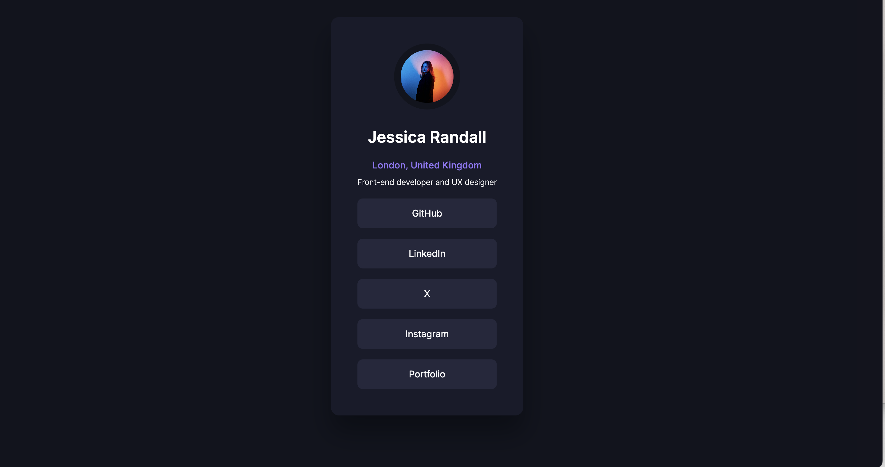

# Link Card - Exploring Figma AI Capabilities



## Overview

This is a front-end project exploring Figma's new AI capabilities. The goal was to quickly create a simple, sleek profile link card using only CSS.

## Features

- Clean and minimal UI
- Responsive design
- Pure CSS styling
- Quick-win project to test AI-generated designs from Figma

## Technologies Used

- HTML
- CSS

## Installation & Usage

1. Clone the repository:
   ```bash
   git clone https://github.com/yourusername/link-card.git
   ```
